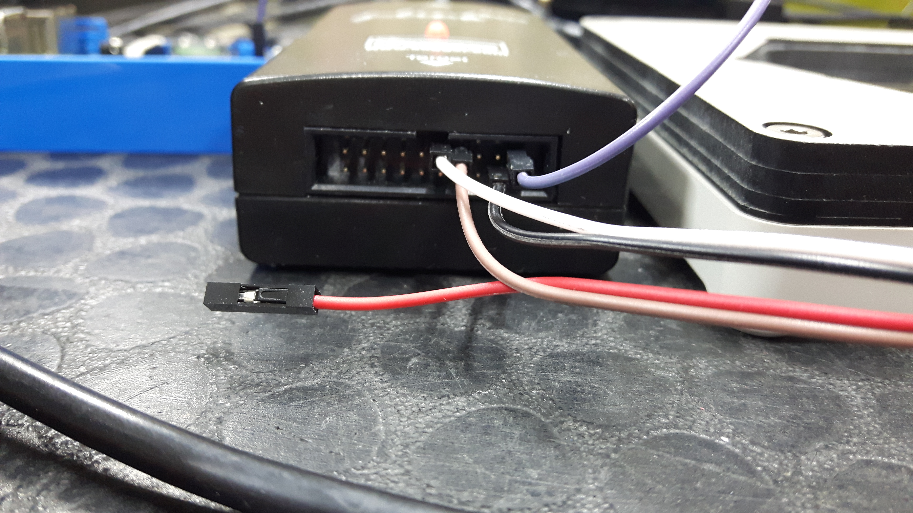

# Calliope mini rev. 1.0 Test Procedure

1. Connect USB
2. Put in test device
3. wait for bootloader & interface firmware flash
4. Take off test device
6. wait for test firmware flash
7. check led matrix, accel, rgb led, triple beep
8. disconnect

Takes approx. 40s per device.

The test code is found here: [CalliopeTestBoard.cpp](https://github.com/calliope-mini/calliope-playground/blob/master/source/CalliopeTestBoard.cpp)

## Wiring

Wiring of the test adapter pins to the SEGGER.

We need external 3.3V to trick the SEGGER VTref pin into believing it has the correct voltage.

