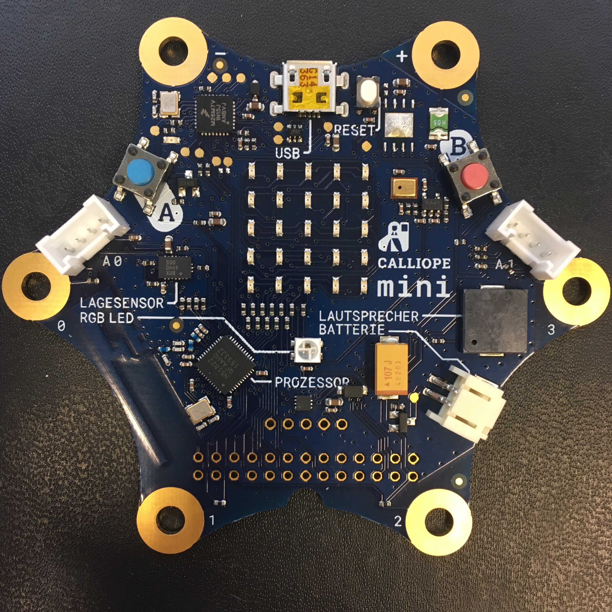
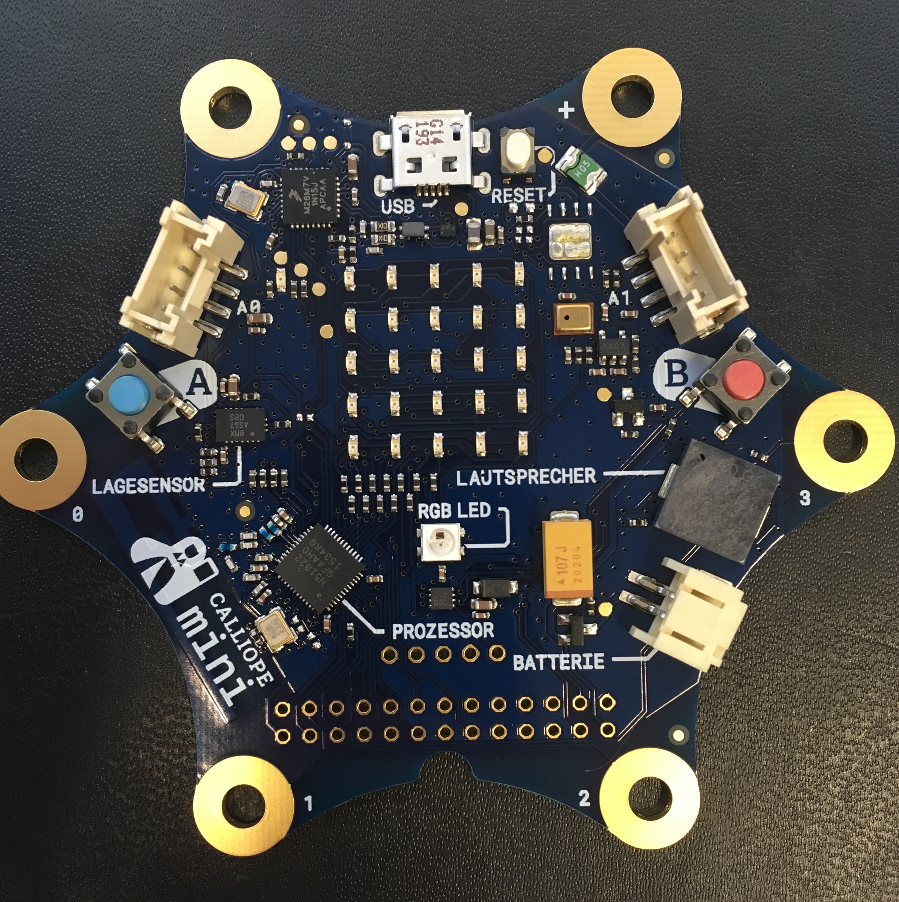
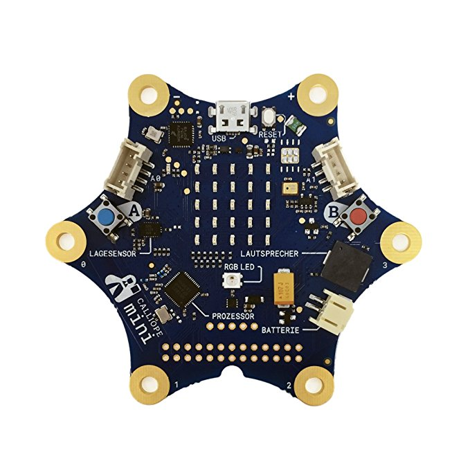

# production-test

Procedure, Code and Scripts for testing Calliope mini boards

Current procedure requires a SEGGER JLink debug probe. You need to download the tools from the SEGGER website.

# Board versions

## revision 0.3 (IT Gipfel, 2016)

## revision 1.0 (2017)

- Grove connectors and Buttons are swapped for usability
- right Grove has different pins, analog in capable 
    - RX/TX (`p16`/`p21` -> `p26`/`p27`)
- Button B pin changed (`p26` -> `p16`)
- Accelerometer interrupt pin changed (`p27` -> `p21`)     

## revision 1.3 (2018)

- expanded Motor driver connector, press-fit ready
- fixed power separation for battery / USB

